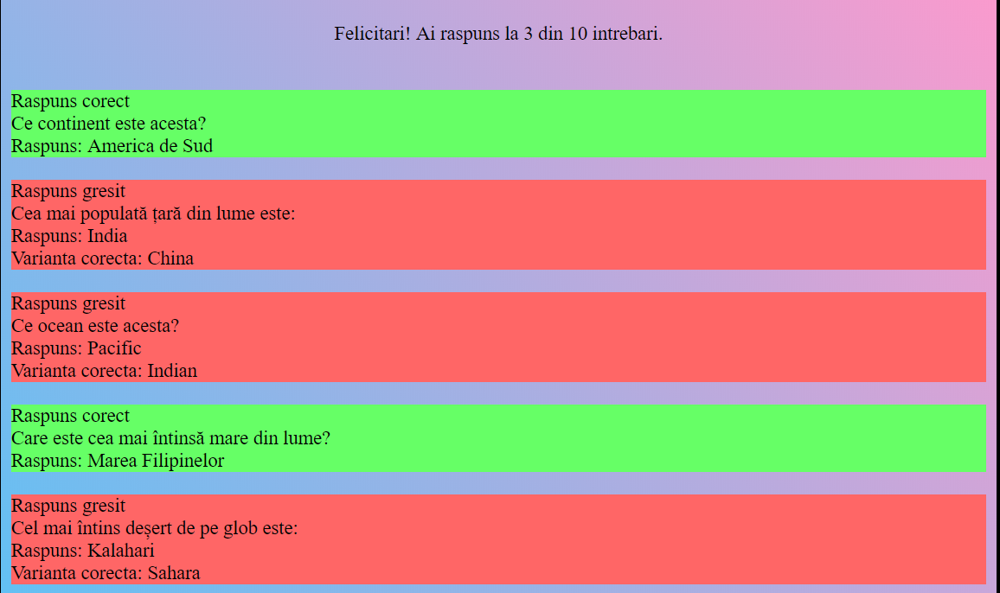

# TesteGeografie

Tot ce trebuie sa faceti este sa accesati link-ul de mai jos

https://riri0411.github.io/TesteGeografie/

Site este destinat utilizarii in scop educational, elevilor de gimnaziu, si nu numai, pentru a invata geografie. Este free.

Sunt disponibile 5 teste care acopera cunostintele generale dobandite de elevii din clasele 5-8 la geografie.
Dupa ce raspunzi la toate intrebarile, la sfarsit, se va afisa scorul si intrebarile, evidentiindu-se unde nu ai ales varianta corecta.

